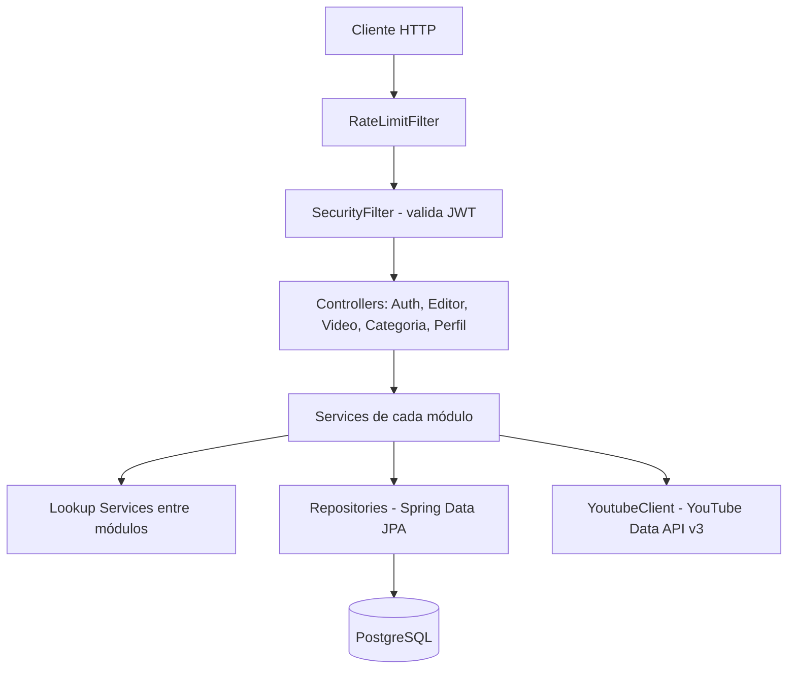

# AceleraFlix


Plataforma de streaming de vídeos educacionais de tecnologia, curados a partir do YouTube. O objetivo é oferecer um catálogo organizado por categorias e tags — sem feed, sem recomendação aleatória — para quem já sabe o que está procurando.

## Sumário

- [Visão geral](#visão-geral)
- [Tecnologias](#tecnologias)
- [Arquitetura](#arquitetura)
- [Módulos](#módulos)
- [API](#api)
- [Autenticação e segurança](#autenticação-e-segurança)
- [Banco de dados](#banco-de-dados)
- [Configuração do ambiente](#configuração-do-ambiente)
- [Como executar](#como-executar)
- [Testes](#testes)
- [Swagger/OpenAPI](#swaggeropenapi)
- [Estrutura de diretórios](#estrutura-de-diretórios)

## Visão geral

O AceleraFlix é o backend de uma plataforma para catalogar vídeos educacionais de tecnologia hospedados no YouTube. Usuários se cadastram, podem solicitar o papel de **editor** para submeter vídeos, e um **admin** aprova ou rejeita essas solicitações. Vídeos são organizados por categoria e por tags, e os metadados (título, thumbnail, duração) são obtidos automaticamente da API do YouTube no momento do cadastro.

Principais características técnicas confirmadas no código:

- API REST stateless autenticada via JWT (access + refresh token)
- Controle de acesso baseado em papéis (`USUARIO`, `EDITOR`, `ADMIN`) com `@PreAuthorize`
- Fluxo de aprovação de editores (solicitar → aprovar/rejeitar/revogar)
- Enriquecimento automático de vídeos com metadados reais do YouTube (título, thumbnail, duração)
- Paginação, busca por texto e filtros nas listagens de vídeo
- Rate limiting por IP em todas as requisições
- Migrations versionadas com Flyway
- Documentação interativa via Swagger/OpenAPI

## Tecnologias

| Categoria | Tecnologia |
|---|---|
| Linguagem | Java 21 |
| Framework | Spring Boot 4.1.0 |
| Segurança | Spring Security, JWT (`java-jwt` / Auth0), BCrypt |
| Persistência | Spring Data JPA / Hibernate |
| Banco de dados | PostgreSQL |
| Migrations | Flyway |
| Documentação | springdoc-openapi (Swagger UI) |
| Rate limiting | Bucket4j |
| Build | Maven |
| Utilitários | Lombok, Bean Validation (Jakarta Validation) |
| Testes | JUnit 5, Spring Boot Test, Spring Security Test, Testcontainers (PostgreSQL) |
| Containerização | Docker (multi-stage build) |

> As dependências de teste (Spring Security Test, Testcontainers) estão declaradas no `pom.xml`, mas não há, no momento, classes de teste que as utilizem — veja a seção [Testes](#testes).

## Arquitetura

O projeto é um **monólito modular**: uma única aplicação Spring Boot, organizada em módulos por domínio de negócio (`auth`, `video`, `category`, `profile`, `shared`), cada um seguindo o mesmo padrão interno de camadas:

- **`api`** — controllers REST (camada de entrada HTTP)
- **`application`** — services, DTOs, mappers e exceções de negócio
- **`domain`** — entidades JPA
- **`infrastructure`** — repositories e integrações externas (ex: cliente do YouTube, JWT, filtros de segurança)

Um ponto arquitetural relevante é o uso de **interfaces de lookup** (`UserLookupService`, `CategoriaLookupService`, `PerfilLookupService`) para que um módulo consulte dados de outro sem depender diretamente do seu repositório ou de suas entidades internas — funcionando como uma camada anticorrupção entre módulos. É assim, por exemplo, que `VideoMapper` monta a resposta de um vídeo combinando dados de `video`, `category`, `auth` e `profile` sem acoplamento direto entre os módulos.

O módulo `shared` concentra a infraestrutura transversal: tratamento global de exceções (`GlobalExceptionHandler`), rate limiting (`RateLimitFilter` + `RateLimitingService`) e verificação de permissão de dono do recurso (`PermissionChecker`).



## Módulos

### `auth`

Cadastro, login, emissão/renovação de tokens JWT e o fluxo de aprovação de editores.

- **Entidade:** `Usuario` (nome, e-mail, senha com hash, `role`, `statusEditor`)
- **Enums:** `RoleUsuario` (`USUARIO`, `EDITOR`, `ADMIN`), `StatusEditor` (`NENHUM`, `PENDENTE`, `APROVADO`, `REVOGADO`)
- **Services:** `AuthService` (registro, login, refresh de token), `EditorService` (solicitar/aprovar/rejeitar/revogar edição)
- **Exposto para outros módulos via:** `UserLookupService`

### `video`

Catálogo de vídeos, com enriquecimento automático via YouTube.

- **Entidades:** `Video` (título, descrição, URL, ID externo do YouTube, plataforma, thumbnail, duração, categoria, criador, status, tags), `Tag`
- **Enums:** `Plataforma` (`YOUTUBE`, `VIMEO`), `StatusVideo` (`APROVADO`, `NEGADO`, `PENDENTE`)
- **Services:** `VideoService` (CRUD, busca, listagem por categoria/criador), `TagResolver` (normaliza tags em minúsculo e reaproveita as já existentes)
- **Infraestrutura:** `YoutubeClient` (consulta a YouTube Data API v3), `YoutubeUrlParser` (extrai o ID do vídeo da URL via regex), `YoutubeDurationParser` (converte duração ISO 8601 em segundos)
- **Regra de negócio:** ao criar um vídeo, a URL do YouTube é validada, os metadados são buscados na API do YouTube e a categoria informada precisa existir

### `category`

Categorias usadas para organizar os vídeos.

- **Entidade:** `Categoria` (nome, slug único gerado automaticamente, descrição, criador)
- **Service:** `CategoriaService` (CRUD com geração de slug a partir do nome, removendo acentos)
- **Regra de negócio:** não é possível excluir uma categoria que ainda possua vídeos vinculados (`CategoryWithVideoException`)
- **Exposto para outros módulos via:** `CategoriaLookupService`

### `profile`

Perfil público do usuário (username, bio, avatar, links sociais).

- **Entidade:** `Perfil` (vinculado 1:1 a `Usuario`, com username único, bio, avatar, GitHub, LinkedIn, flag de verificado)
- **Service:** `PerfilService` (criação, atualização, busca por usuário autenticado ou por username público)
- **Regra de negócio:** se nenhum avatar for informado, é gerado um avatar padrão via [DiceBear](https://www.dicebear.com/)
- **Exposto para outros módulos via:** `PerfilLookupService`

### `shared`

Infraestrutura transversal usada por todos os módulos.

- `GlobalExceptionHandler`: converte exceções de negócio em respostas HTTP padronizadas (`status`, `mensagem`, `timestamp`)
- `RateLimitFilter` / `RateLimitingService`: limitação de requisições por IP usando Bucket4j
- `PermissionChecker`: valida se o usuário autenticado é o dono do recurso ou um admin

## API

Todas as rotas abaixo foram confirmadas diretamente nos controllers.

### Autenticação (`/auth`)

| Método | Endpoint | Descrição | Auth |
|---|---|---|---|
| POST | `/auth/register` | Cria um novo usuário e retorna os tokens | Não |
| POST | `/auth/login` | Autentica e retorna os tokens | Não |
| POST | `/auth/refresh` | Gera um novo par de tokens a partir do refresh token | Não |
| GET | `/auth/me` | Retorna dados do usuário autenticado | Sim |

### Editores (`/editores`)

| Método | Endpoint | Descrição | Auth |
|---|---|---|---|
| POST | `/editores/solicitar` | Solicita o papel de editor | Sim |
| GET | `/editores/pendentes` | Lista solicitações pendentes | Sim (ADMIN) |
| GET | `/editores/aprovados` | Lista editores aprovados | Sim (ADMIN) |
| PATCH | `/editores/{usuarioId}/aprovar` | Aprova uma solicitação | Sim (ADMIN) |
| PATCH | `/editores/{usuarioId}/rejeitar` | Rejeita uma solicitação | Sim (ADMIN) |
| PATCH | `/editores/{usuarioId}/revogar` | Revoga o papel de editor | Sim (ADMIN) |

### Vídeos (`/videos`)

| Método | Endpoint | Descrição | Auth |
|---|---|---|---|
| GET | `/videos` | Lista vídeos, com paginação. Aceita `q` (busca em título/descrição/tags) ou `criadoPor` (filtra por autor) | Não |
| GET | `/videos/{id}` | Busca um vídeo por ID | Não |
| GET | `/videos/categoria/{categoriaId}` | Lista vídeos de uma categoria, paginado | Não |
| POST | `/videos` | Cria um vídeo (busca metadados no YouTube automaticamente) | Sim (EDITOR ou ADMIN) |
| PUT | `/videos/{id}` | Atualiza um vídeo existente | Sim (dono ou ADMIN) |
| DELETE | `/videos/{id}` | Remove um vídeo | Sim (dono ou ADMIN) |

### Categorias (`/categorias`)

| Método | Endpoint | Descrição | Auth |
|---|---|---|---|
| GET | `/categorias` | Lista todas as categorias | Não |
| GET | `/categorias/{id}` | Busca uma categoria por ID | Não |
| POST | `/categorias` | Cria uma categoria | Sim (EDITOR ou ADMIN) |
| PUT | `/categorias/{id}` | Atualiza uma categoria | Sim (dono ou ADMIN) |
| DELETE | `/categorias/{id}` | Remove uma categoria (falha se houver vídeos vinculados) | Sim (dono ou ADMIN) |

### Perfil (`/u`)

| Método | Endpoint | Descrição | Auth |
|---|---|---|---|
| POST | `/u` | Cria o perfil do usuário autenticado | Sim |
| PUT | `/u` | Atualiza o perfil do usuário autenticado | Sim |
| GET | `/u` | Busca o perfil do usuário autenticado | Sim |
| GET | `/u/me` | Busca o perfil do usuário autenticado (alias) | Sim |
| GET | `/u/{username}` | Busca um perfil público por username | Não |

**Exemplo de criação de vídeo:**

```json
POST /videos
Authorization: Bearer <access_token>

{
  "titulo": "Introdução ao Spring Boot",
  "descricao": "Aula sobre os fundamentos do framework",
  "urlYoutube": "https://www.youtube.com/watch?v=xxxxxxxxxxx",
  "categoriaId": "b0e6c1a0-....",
  "tags": ["spring", "java", "backend"]
}
```

## Autenticação e segurança

- **Login/registro** (`AuthService`): a senha é validada e comparada com hash BCrypt (força 10). Em caso de sucesso, é gerado um par de tokens JWT.
- **Access token**: expira em 15 minutos (`900000` ms), contém `type=access`, `role` e `email` como claims.
- **Refresh token**: expira em 7 dias (`604800000` ms), contém `type=refresh`. É usado apenas para gerar um novo par de tokens em `/auth/refresh` — não há armazenamento do refresh token no banco (não há blacklist/revogação de token).
- **Transporte do token**: via header `Authorization: Bearer <token>`. Não há uso de cookies no fluxo de autenticação.
- **Validação**: o `SecurityFilter` intercepta cada requisição, extrai o token do header, valida a assinatura e o `type` esperado (`access`) via `JwtProvider`, e popula o contexto de segurança do Spring.
- **Roles/perfis:** `USUARIO`, `EDITOR`, `ADMIN` — atribuídas via `@PreAuthorize("hasRole('...')")` nos controllers. A autoridade é montada como `ROLE_<role>`.
- **Autorização por dono do recurso:** para vídeos e categorias, além do papel, `PermissionChecker` garante que apenas o criador do recurso (ou um ADMIN) possa editar/excluir.
- **CORS:** origens permitidas configuráveis via `cors.allowed-origins` (padrão `http://localhost:5173`), com suporte a múltiplas origens separadas por vírgula. Métodos liberados: `GET, POST, PUT, DELETE, PATCH, OPTIONS`. Credenciais permitidas.
- **CSRF:** desabilitado (API stateless baseada em token, sem sessão).
- **Rotas públicas:** `POST /auth/**`, `GET /videos/**`, `GET /categorias/**`, `GET /u/**`, `/swagger-ui/**`, `/v3/api-docs/**`. Todas as demais exigem autenticação.
- **Rate limiting:** todas as requisições passam por `RateLimitFilter`, que limita a 60 requisições por minuto por IP (identificado via header `X-Forwarded-For` ou IP remoto), retornando `429` quando o limite é excedido.

## Banco de dados

- **SGBD:** PostgreSQL
- **Estratégia:** JPA/Hibernate com `ddl-auto: validate` — o schema é controlado inteiramente pelas migrations do Flyway, não pelo Hibernate.
- **Migrations:** localizadas em `src/main/resources/db/migration`, aplicadas automaticamente na inicialização (`flyway.enabled: true`, `baseline-on-migrate: true`).

### Entidades principais e relacionamentos

- `usuario` — tabela raiz de autenticação
- `categoria` — referencia `usuario` (criador) via `criado_por`
- `video` — referencia `categoria` e `usuario` (criador)
- `tag` — relaciona-se com `video` via tabela associativa `video_tag` (many-to-many)
- `perfil` — relação 1:1 com `usuario` (FK com `ON DELETE CASCADE`)

### Histórico relevante das migrations

O projeto passou por iterações: a V4 introduziu uma feature de "shorts" (`es_short`), que foi revertida na V6 (junto com a exigência de categoria obrigatória no vídeo). As migrations V8/V9 criaram uma feature de "trilhas/roadmap", que foi completamente revertida na V10 — portanto **não há atualmente nenhuma funcionalidade de roadmap/trilha implementada no código**, apesar de existirem migrations com esse histórico.

## Configuração do ambiente

### Pré-requisitos

- Java 21
- Maven (ou use o wrapper `./mvnw` incluso no projeto)
- PostgreSQL
- Uma chave de API do YouTube Data API v3

### Variáveis de ambiente

```env
DB_URL=
DB_USERNAME=
DB_PASSWORD=
JWT_SECRET=
YOUTUBE_API_KEY=

# Opcionais (possuem valor padrão)
SERVER_PORT=8080
ALLOWED_ORIGINS=http://localhost:5173
SPRINGDOC_ENABLED=true
```

| Variável | Obrigatória | Descrição |
|---|---|---|
| `DB_URL` | Sim | URL JDBC de conexão com o PostgreSQL |
| `DB_USERNAME` | Sim | Usuário do banco |
| `DB_PASSWORD` | Sim | Senha do banco |
| `JWT_SECRET` | Sim | Segredo usado para assinar/validar os tokens JWT (HMAC256) |
| `YOUTUBE_API_KEY` | Sim | Chave da YouTube Data API v3, usada para buscar metadados dos vídeos |
| `SERVER_PORT` | Não | Porta da aplicação (padrão `8080`) |
| `ALLOWED_ORIGINS` | Não | Origens liberadas no CORS, separadas por vírgula (padrão `http://localhost:5173`) |
| `SPRINGDOC_ENABLED` | Não | Habilita/desabilita o Swagger UI e o `/v3/api-docs` (padrão `true`) |

## Como executar

### Localmente com Maven

```bash
git clone <url-do-repositorio>
cd aceleraflix

# defina as variáveis de ambiente listadas acima antes de rodar

./mvnw spring-boot:run
```

A aplicação sobe por padrão em `http://localhost:8080`. As migrations do Flyway são aplicadas automaticamente contra o banco configurado em `DB_URL`.

### Com Docker

O projeto possui um `Dockerfile` multi-stage (build com Maven + imagem final com JRE 21, rodando como usuário não-root).

```bash
docker build -t aceleraflix .
docker run -p 8080:8080 \
  -e DB_URL=... \
  -e DB_USERNAME=... \
  -e DB_PASSWORD=... \
  -e JWT_SECRET=... \
  -e YOUTUBE_API_KEY=... \
  aceleraflix
```

> Não há `docker-compose.yml` no projeto — o container espera um PostgreSQL já disponível e acessível via `DB_URL`.

## Testes

Atualmente o projeto contém apenas um teste de contexto:

- `AceleraflixApplicationTests`: verifica se o contexto do Spring Boot sobe corretamente (`contextLoads`), sem asserções de negócio.

Não há, no código, testes unitários de services, testes de controller ou testes de repository. As dependências para isso (`spring-security-test`, `testcontainers` com PostgreSQL e JUnit Jupiter) já estão declaradas no `pom.xml`, mas ainda não possuem testes escritos que as utilizem.

## Swagger/OpenAPI

Documentação interativa gerada via `springdoc-openapi`, habilitada por padrão (`SPRINGDOC_ENABLED=true`):

- **Swagger UI:** `/swagger-ui.html`
- **Especificação OpenAPI (JSON):** `/v3/api-docs`

Ambas as rotas são públicas (não exigem autenticação) e permitem explorar todos os endpoints documentados neste README diretamente na aplicação em execução.

## Estrutura de diretórios

```text
src/
├── main/
│   ├── java/vitortheof/com/br/aceleraflix/
│   │   ├── auth/            # cadastro, login, JWT, aprovação de editores
│   │   │   ├── api/
│   │   │   ├── application/
│   │   │   ├── domain/
│   │   │   └── infrastructure/
│   │   ├── category/        # categorias de vídeo
│   │   ├── video/           # catálogo de vídeos + integração YouTube
│   │   ├── profile/         # perfil público do usuário
│   │   ├── shared/          # exceções globais, rate limiting, permissões
│   │   └── AceleraflixApplication.java
│   └── resources/
│       ├── application.yaml
│       └── db/migration/    # migrations Flyway (V1 a V10)
└── test/
    └── java/vitortheof/com/br/aceleraflix/
        └── AceleraflixApplicationTests.java
```
